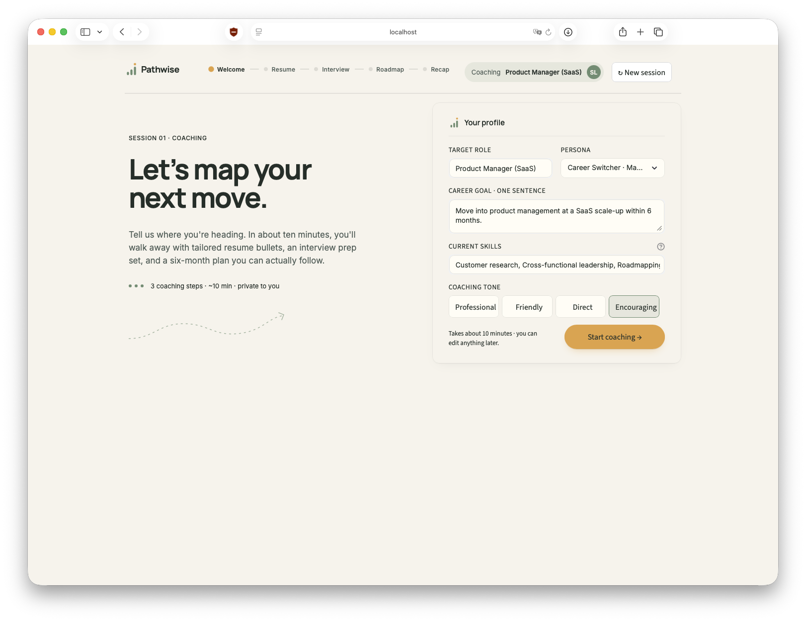
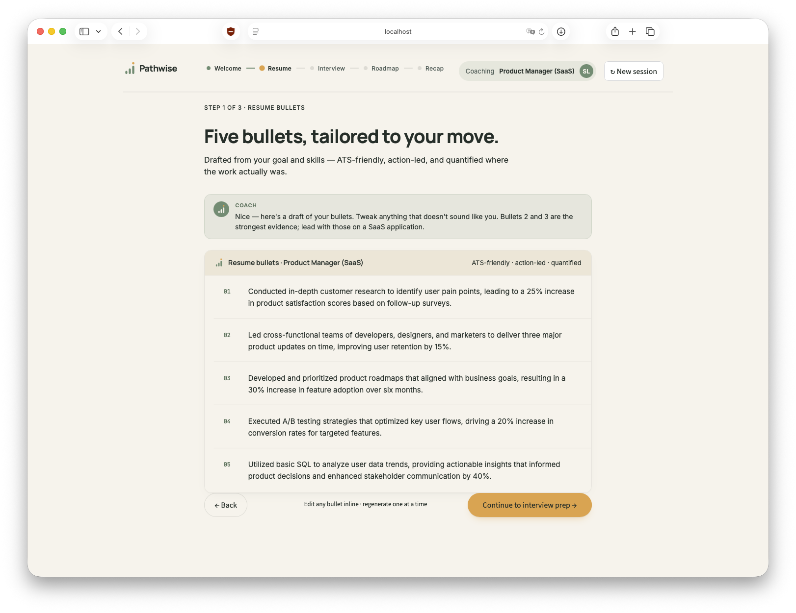
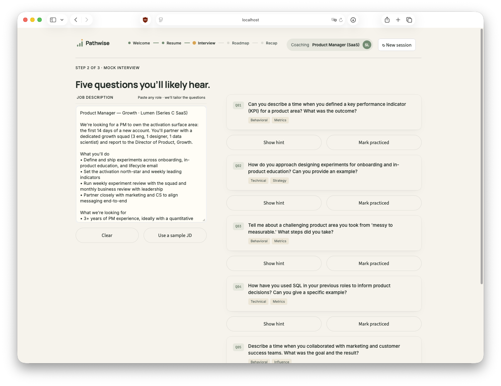
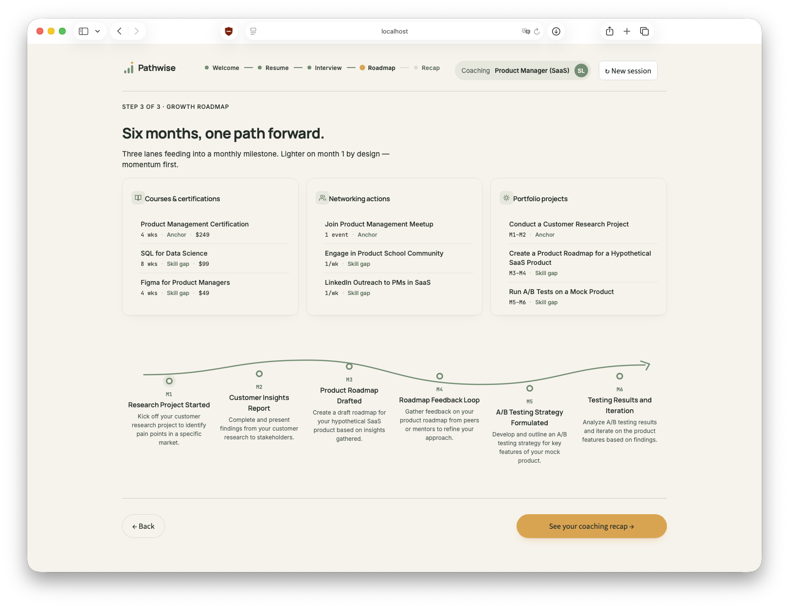
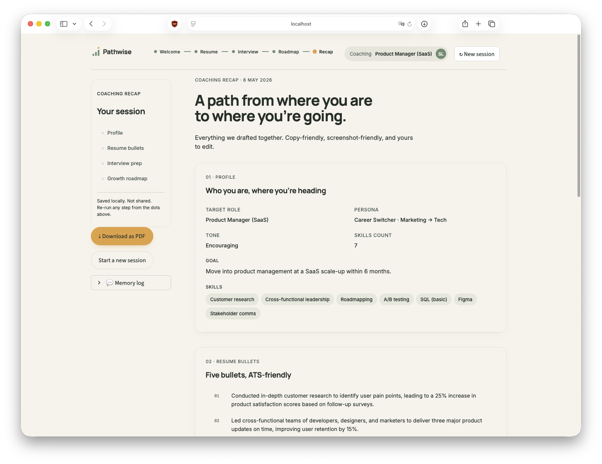

# Pathwise — Personalized AI Career Coach

ADA AI Professional · module 7 · final assignment.
Multi-step, memory-aware GenAI app built with **LangChain** + **Streamlit**.

## What it does

Five screens, three LCEL chains, one warm-mentor coach.

1. **Welcome / Profile** — capture target role, persona, goal, skills, tone
2. **Step 1 · Resume bullets** — five ATS-aware bullets, action-led
3. **Step 2 · Mock interview** — five tailored questions + answer hints from a JD
4. **Step 3 · Growth roadmap** — 6-month plan: courses, networking, projects, monthly milestones
5. **Coaching recap** — single page that surfaces every artefact

`ConversationBufferMemory` logs every coach turn; "New session" wipes everything.

## Setup

```bash
# .env — pick ONE of:
echo "OPENROUTER_API_KEY=sk-or-v1-..." > .env   # routes via OpenRouter (multi-model gateway)
# or
echo "OPENAI_API_KEY=sk-..." > .env             # direct to OpenAI

# install
pip install -r requirements.txt

# run
streamlit run app.py
```

If `OPENROUTER_API_KEY` is set the app uses OpenRouter (`openai/gpt-4o-mini` by default); otherwise it falls back to the standard OpenAI endpoint.

Or with Docker:

```bash
docker compose up --build
# open http://localhost:8501
```

## File map

| File | Role |
|---|---|
| `app.py` | Streamlit driver — wizard + state, calls chains, renders screens |
| `chains.py` | 3 `ChatPromptTemplates`, 3 LCEL chains with structured (Pydantic) outputs, `ConversationBufferMemory` helpers |
| `ui.py` | Brand HTML/SVG helpers (lockup, glyph, stepper, coach line, milestone path…) |
| `static/brand.css` | Brand tokens + Streamlit overrides — sage/cream/amber palette, Manrope + Inter |
| `requirements.txt` | Pinned deps (LangChain 1.x via `langchain-classic` for memory) |
| `Dockerfile`, `docker-compose.yml` | Container setup, port 8501 |
| `docs/superpowers/specs/2026-05-06-pathwise-design.md` | Locked design spec |
| `.design-handoff/` | Reference design prototype (HTML/CSS/JSX) |

## LangChain techniques used

- `ChatPromptTemplate.from_messages` for system + human prompt structure
- LCEL — chains assembled with `prompt | llm.with_structured_output(Schema)`
- Pydantic schemas (`ResumeBullets`, `Interview`, `Roadmap`) for typed chain outputs — no string parsing on the UI side
- `ConversationBufferMemory(return_messages=True)` — the coach turn log
- Streamlit `session_state` for wizard step, memory, outputs, and per-question UI state (expanded, practiced)

## Brand & UI

The visual system was prototyped first as a React+CSS reference (in `.design-handoff/`) and re-implemented in Streamlit with custom CSS:

- **Palette:** sage `#6F8F73`, cream `#F7F3EC`, ink `#1F2A24`, amber accent `#E0A24B`
- **Type:** Manrope 600/700 (display) · Inter 400/500 (body) · JetBrains Mono (numerics)
- **Logo:** stepped-horizon glyph (three sage pills + amber summit dot) + wordmark — see `ui.py::path_glyph` and `ui.py::lockup`
- Streamlit's default chrome (toolbar, hamburger menu, footer) is hidden via `static/brand.css`

## Reflection (300–500 words)

### Design approach & trade-offs

I split the coach into three sequential LCEL chains — resume → interview → roadmap — instead of one unified chain. Each step has a different output shape and intent (free-text bullets, structured questions+hints, structured roadmap), so a single prompt would either compromise on quality or balloon in size. Splitting also lets me set per-chain temperature and let the user re-run a single step without invalidating the others.

The course brief listed three example prompts: Resume, Goal Setting, and Mock Interview. I deliberately reframed Goal Setting as the roadmap step rather than its own prompt: the `Roadmap.milestones` field forces six dated targets (M1..M6), each with a measurable deliverable — that *is* SMART goal setting, just made structural rather than rhetorical. The order resume → interview → roadmap also matches a real coaching arc: first prove the candidate's evidence, then pressure-test it against a specific role, then translate the gaps into a time-bound plan.

For typed outputs I used `llm.with_structured_output(PydanticModel)` instead of `StrOutputParser`. This was the highest-leverage decision in the whole project: the UI consumes typed `Roadmap.milestones` directly, so the milestone path SVG and the recap tile grid get clean data with zero string parsing.

For memory I picked `ConversationBufferMemory` (via `langchain-classic`, which preserves the legacy class on LangChain 1.x). The assignment specifies this class, and a 3-step session is short enough that summarisation or windowing isn't needed. I write to `memory.save_context` after each chain call rather than letting the chain own the memory — this lets each step still receive whichever earlier outputs it needs, while keeping the memory log clean for the recap.

The biggest UI trade-off was Streamlit vs. design fidelity. The reference design in `.design-handoff/` is a polished React+CSS prototype. Streamlit can't render arbitrary React, so I rebuilt the look in Streamlit primitives plus heavy custom CSS in `static/brand.css`, with HTML helpers in `ui.py` for the parts where Streamlit widgets fall short (the milestone path SVG, the coach line, the bullet card). Pixel-perfect was never the goal; brand-coherent was. The wizard structure is preserved (Welcome → 3 coaching steps → Recap), and so are the visual hooks: stepped-horizon glyph, sage/cream/amber palette, Manrope headings, warm-mentor microcopy.

### Scaling the app

1. **Latency** — chains run sequentially today and call OpenAI synchronously. For a real coach I'd switch to `chain.astream()` + `st.write_stream`, and pre-compute step 3 in the background while the user reads step 2's output.
2. **Persistence** — `ConversationBufferMemory` lives in `st.session_state`, which dies with the tab. To support resumable sessions, swap to `RunnableWithMessageHistory` backed by `RedisChatMessageHistory` or `PostgresChatMessageHistory`; the API stays nearly identical.
3. **Multi-tenant** — Streamlit is single-process. To scale beyond a single demo I'd front the chains with FastAPI, give each user a `session_id` (UUID at sign-in), and pull the OpenAI key from a server-side secret manager rather than `.env`. The Streamlit app would become one of several frontends (web, Slack bot, in-app overlay) hitting the same backend.

## Bonus / future work

- [ ] PDF/Word resume upload (PyMuPDF) auto-fills the skills chips
- [ ] Multi-LLM choice (OpenAI / Claude via Anthropic SDK / local Llama via Ollama)
- [ ] Whisper voice input for the career-goal field
- [ ] Real PDF export of the recap page (currently a toast stub)
- [ ] Deploy on Streamlit Community Cloud / Hugging Face Spaces

## Screenshots

### 1. Welcome / Profile



### 2. Step 1 · Resume bullets



### 3. Step 2 · Mock interview



### 4. Step 3 · Growth roadmap



### 5. Coaching recap


